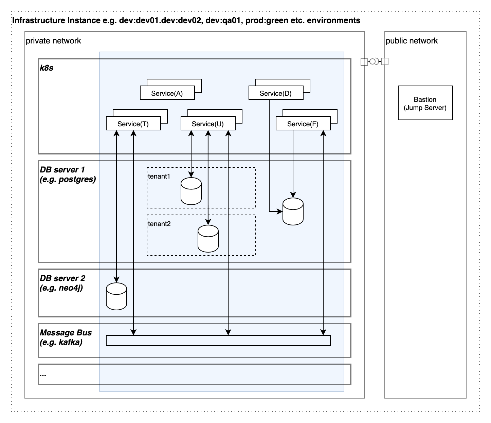

# Description
## Cloud agnostic IaC based SaaS skeleton.


## Features
* supports AWS, DO (Azure, GCP - in progress)
* provides Multi-tenancy feature via layers architecture (Provider, Network, Managed, Appl, Tenant)
* implements easy-to-construct multiple environment approach, controls by one environment variable - **TF_VAR_env_id**
* IaC - Terraform, Helm
* supports of multiple backend providers - Local, Cloud, PG (S3 - in progress)

## Quick start
* Install [tln](https://www.npmjs.com/package/tln-cli)
* Goto **projects** folder from tln-cli installation above and clone repository
  ```
  git clone --depth 1 --branch v23.9.0 git@github.com:project-talan/tln-clouds.git && cd tln-clouds
  ```
> Important<br>
> Commands below assume that Terraform Cloud is used as a storage for states<br/>
> By skipping **--backend cloud** local backend will be used
* Use **.env.template** file as an examples and fill it with actual values
  * root .env
    ```
    TF_VAR_org_id=<your_terraform_cloud_org>
    TF_VAR_project_id=tln-clouds
    TF_VAR_env_id=dev
    TF_VAR_tenant_id=

    TF_TOKEN_app_terraform_io=<your_terraform_cloud_token>
    ```
### Digital Ocean
  * Create **do/.env** file using **do/.env.template** as an example
    ```
    DIGITALOCEAN_TOKEN=<your_do_token>

    TF_VAR_do_region=nyc3
    TF_VAR_do_k8s_version=1.27.4-do.0
    TF_VAR_do_k8s_nodes_min=1
    TF_VAR_do_k8s_nodes_max=2
    TF_VAR_do_k8s_nodes_size=s-2vcpu-2gb
    ```
* Install dependencies
  ```
  tln install do --depends
  ```
* Construct DO Dev infrastructure instance
  ```
  tln construct do -- --backend cloud --init --plan --apply
  ```
* Verify access to the k8s cluster and install/uninstall ingress
  * Create ssh session
    ```
    tln shell do
    ```
    ```
    tln nginx-ingress-install@k8s -- --ver 4.7.2
    ```
    ```
    kubectl get pods --all-namespaces
    ```
    ```
    tln nginx-ingress-status@k8s
    ```
  * Use IP address from command outpu below to check access to the cluster using browser/curl
  * Uninstall Ingress
    ```
    tln nginx-ingress-uninstall@k8s
    ```
  * Close ssh session
    ```
    ^d
    ```
* Deconstruct DO Dev infrastructure instance
  ```
  tln deconstruct do -- --backend cloud --plan --apply
  ```
### AWS
  * Create **aws/.env** file using **aws/.env.template** as an example
    ```
    AWS_ACCESS_KEY_ID=<your_aws_id>
    AWS_SECRET_ACCESS_KEY=<your_aws_key>
    AWS_SESSION_TOKEN=

    AWS_DEFAULT_REGION=eu-central-1

    TF_VAR_aws_k8s_version=1.27
    TF_VAR_aws_k8s_nodes_min=1
    TF_VAR_aws_k8s_nodes_desired=2
    TF_VAR_aws_k8s_nodes_max=3
    TF_VAR_aws_k8s_nodes_size=t3a.medium
    TF_VAR_aws_k8s_nodes_disk=50
    ```
* Install dependencies
  ```
  tln install aws --depends
  ```
* Construct AWS Dev infrastructure instance
  ```
  tln construct aws -- --backend cloud --init --plan --apply
  ```
* Verify access to the k8s cluster and install/uninstall ingress
  * Open separate terminal and establish connection with bastion, use user@ip from previous command output (bastion_remote_address)
    ```
    tln bridge aws -- --bastion user@ip
    ```
  * Switch back to the original terminal and initiate session for kubectl
    ```
    tln connect aws
    ```
    ```
    tln nginx-ingress-install@k8s -- --ver 4.7.2
    ```
    ```
    kubectl get pods --all-namespaces
    ```
    ```
    tln nginx-ingress-status@k8s
    ```
    * Use DNS address name from command output below to check access to the cluster using browser/curl
    * Uninstall Ingress
    ```
    tln nginx-ingress-uninstall@k8s
    ```
    * Close both terminals
    ```
    ^d
    ```
* Deconstruct AWS Dev infrastructure instance
  ```
  tln deconstruct aws -- --backend cloud --plan --apply
  ```
## Command line options
General format
```
tln [construct | deconstruct] [do | aws] [-u] -- [option, [option], ...]
```
| Option  | Description | Example |
| ------------- | ------------- | ------------- |
| backend | Defines which backend provider should bu used (cloud, pg) | $ tln construct do -- --backend cloud <br /> $ tln construct aws -- --backend pg |
| state | Defines how store name will be built: project, provider, env, layer, tenant, <custom_string> | $ tln construct do -- --backend cloud -- state project,provider,env,layer <br /> will use tln-clouds-do-dev-managed Terraform Cloud workspace  |
| init | Run Terraform init | $ tln construct aws -- --backend cloud --init |
| upgrade | Run Terraform upgrade mode for init | $ tln construct aws -- --backend cloud --init --upgrade |
| plan | Run Terraform plan | $ tln construct aws -- --backend cloud --plan |
| apply | Run Terraform apply | $ tln construct aws -- --backend cloud --apply |
| auto-approve | Tun on auto approve for apply & destroy | $ tln construct aws -- --backend cloud --apply --auto-approve |
| layers | Select which layers will be included | $ tln construct aws -- --backend cloud --apply --layers tenant <br /> will construct infrastructure for tenant layer only |
| bastion | Bastion address in form user@ip | $ tln bridge aws -- --bastion devops@192.168.10.1 <br /> will establish ssh connection with local box and bastion |
| bridge-port | Local port for bridge to bastion | $ tln connect aws -- --bridge-port 8888 <br /> will run shell with ssh connection into k8s cluster |
