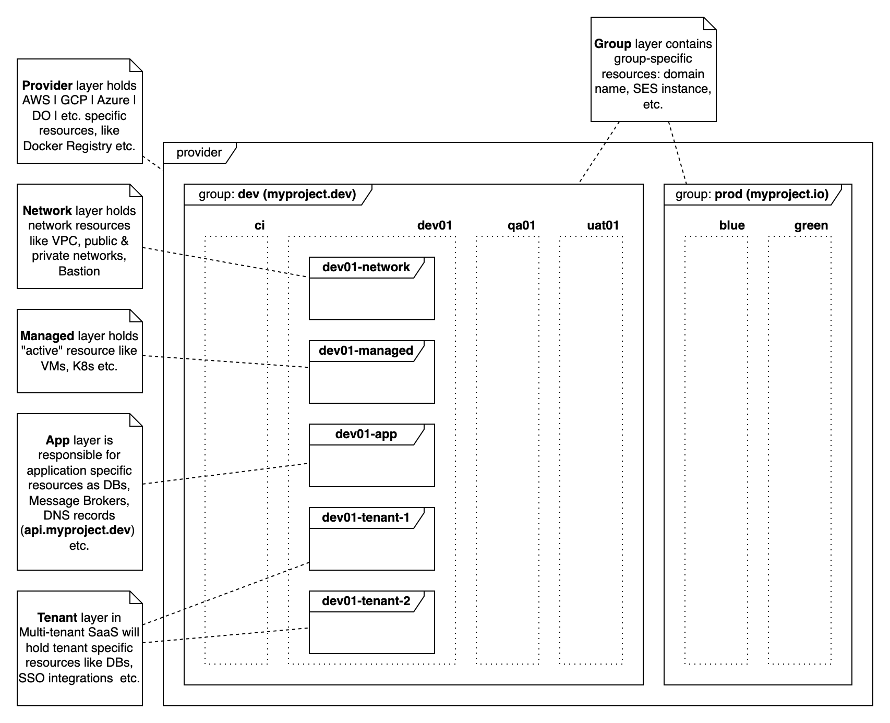

# Description
Talan Clouds is a modular infrastructure platform designed to simplify and standardize cloud-native deployments across environments. It integrates best practices for security, scalability, and automation using Terraform, Kubernetes, and Cloud provider services. Built for flexibility and team collaboration, Talan Clouds accelerates application delivery in modern DevOps ecosystems.

## Cloud Agnostic IaC based SaaS Skeleton.


## Features
* ✅ AWS Support out of the box (Azure and GCP support in progress)
* 🏢 Multi-tenancy architecture using layered design: provider, group, network, managed, app, and tenant
* 🌍 Environment isolation made easy — define multiple environments with a single variable: **TF_VAR_env_id**
* 🛠️ Infrastructure as Code using Terraform and Helm
* 🔗 Multiple backend providers supported: Local, Cloud, PostgreSQL (S3 support coming soon)

## Infrastructure Instance layers


## Quick start
* Install [Nodejs 20.x or higher](https://nodejs.org)
* Install helpers [tln](https://www.npmjs.com/package/tln-cli) & [tpm](https://github.com/project-talan/tln-pm)
    ```
    npm i -g tln-cli@1.110.0 tln-pm@0.19.0 && brew install wget
    ```
* Goto **projects** folder from **tln** installation above and clone repository
  ```
  git clone --depth 1 --branch v25.5.0 git@github.com:project-talan/tln-clouds.git && cd tln-clouds
  ```
* For local development just clone repository as usual
  ```
  git clone git@github.com:project-talan/tln-clouds.git && cd tln-clouds
  ```
> Important<br>
> * Commands below assume that Terraform Cloud is used as a storage for states<br/>
> * By skipping **--backend cloud** local backend will be used<br/>
> * You will need **domain name** to configure all layers (myproject.io as an example below)
* Use **.env.template** file as an examples and fill it with actual values
  * root .env
    TF_TOKEN_app_terraform_io=<your_terraform_cloud_token>

    TF_VAR_org_id=<your_terraform_cloud_org>
    TF_VAR_project_id=myproject
    TF_VAR_group_id=dev
    TF_VAR_env_id=dev01
    TF_VAR_tenant_id=demo

    TF_VAR_account_id=<your_aws_account_id>

    TF_VAR_registry=
    TF_VAR_repositories=["dev.myproject.services.iam","dev.myproject.web.landing"]
    TF_VAR_image_tag_mutability=

    TF_VAR_domain_name=myproject.dev
    TF_VAR_dns_records=dev01.myproject.dev,api
    TF_VAR_use_primary_domain=false
    TF_VAR_api_base_url=https://api.dev01.myproject.dev


    TF_VAR_postgresql={ size = "db.t4g.micro", allocated_storage = "20", max_allocated_storage = "30", master_user_password = true, engine_version = "17.4", family = "postgres17", major_engine_version = "17", multi_az = false, manage_master_user_password = true, backup_schedule = "cron(0 */2 * * ? *)", backup_lifecycle_delete_after = 97, backup_lifecycle_coldstorage_after = 7, rds_snapshot_identifier = null }
    TF_VAR_databases={ "iam" = { owner = "admin", password = "admin" }, "notify" = { owner = "admin", password = "admin" } }

    TF_VAR_db_instance_identifier=
    TF_VAR_tenant_databases={}
    TF_VAR_user_pool_id=
    TF_VAR_use_cognito_provider=false
    TF_VAR_identity_providers={"demo-oidc":{"provider_type":"OIDC","provider_details":{"attributes_request_method":"POST","attributes_url":"https://idp.dev01.myproject.dev/realms/demo/protocol/openid-connect/userinfo","authorize_scopes":"openid profile email","authorize_url":"https://idp.dev01.myproject.dev/realms/demo/protocol/openid-connect/auth","client_id":"demo","client_secret":"...","jwks_uri":"https://idp.dev01.myproject.dev/realms/demo/protocol/openid-connect/certs","oidc_issuer":"https://idp.dev01.tlnclouds.xyz/realms/demo","token_url":"https://idp.dev01.myproject.dev/realms/demo/protocol/openid-connect/token"}}}
    ```
### AWS
  * Create **aws/.env** file using **aws/.env.template** as an example
    ```
    AWS_ACCESS_KEY_ID=<your_aws_id>
    AWS_SECRET_ACCESS_KEY=<your_aws_key>
    AWS_REGION=eu-central-1
    AWS_DEFAULT_REGION=eu-central-1

    TF_VAR_aws_k8s_version=1.33
    TF_VAR_aws_k8s_node_groups={ng1 = { name = "ng1", "instance_types" = ["t3.small"], "min_size": 1, "desired_size": 2, "max_size": 3, "disk_size": 20 }}    
    ```
* **Install dependencies**
  ```
  tln install aws --depends
  ```
* Construct six AWS Infrastructure Instance layers

  * **Provider layer - configure ERC**
    ```
    tln construct aws -- --backend cloud --init --apply --layer provider --state project,provider
    ```
    * **Groupr layer - configure Route53, certificate & validation. You will need to modify DNS nameservers at your registrar side**
      ```
      tln construct aws -- --backend cloud --init --apply --layer group --state project,provider,group
      ```
      * **Network layer - configure VPC, Bastion**
        ```
        tln construct aws -- --backend cloud --init --apply --layer network --state   project,provider,group,env,layer
        ```
      * **Managed layer - K8s**
        ```
        tln construct aws -- --backend cloud --init --apply --layer managed --state project,provider,group,env,layer
        ```
      * **At this point you have secure access via bastion to your cloud resources, initiate sshuttle connection to your cloud network via bastion (first terminal)**
        ```
        tln connect aws -- --layer network --prefix bastion
        ```
      * **Open another shell with necessary environment variables (second terminal)**
        ```
        tln shell aws
        kubectl get pods -A
        ```
      * **Check cluster (second terminal)**
        ```
        kubectl get pods -A
        ```
      * **Deploy App layer - configure Nginx ingress, Postgres DBs, DNS records (second terminal)**
        ```
        tln construct aws -- --backend cloud --init --apply --layer app --state project,provider,group,env,layer
        ```
        * **Deploy Tenant (demo) layer - Tenant specific DNS, database etc.**
          ```
          tln construct aws -- --backend cloud --init --apply --layer tenant --state project,provider,group,env,tenant
          ```
        * **You can check endpoints availability in browser https://dev01.myprojecy.io & https://api.dev01.myproject.io**
        * Now you can deconstruct all layers and free all Cloud resources
        * **Undeploy Tenant (demo)**
          ```
          tln deconstruct aws -- --backend cloud --init --apply --layer tenant --state project,provider,group,env,tenant
          ```
      * **Undeploy App layer**
        ```
        tln deconstruct aws -- --backend cloud --init --apply --layer app --state   project,provider,group,env,layer
        ```
      * **Close sshuttle connection (first terminal)**
        ```
        ^C
        ```
    * **Delete Managed layer**
      ```
      tln deconstruct aws -- --backend cloud --init --apply --layer managed --state project,provider,group,env,layer
      ```
    * **Delete Network layer**
    ```
    tln deconstruct aws -- --backend cloud --init --apply --layer network --state project,provider,group,env,layer
    ```
  * **Delete Groupr layer**
    ```
    tln deconstruct aws -- --backend cloud --init --apply --layer group --state project,provider,group
    ```
* **Delete Provider layer**
  ```
  tln deconstruct aws -- --backend cloud --init --apply --layer provider --state project,provider
  ```

## Command line options
General format
```
tln [construct | deconstruct] [do | aws] [-u] -- [option, [option], ...]
```
| Option  | Description | Example |
| ------------- | ------------- | ------------- |
| backend | Defines which backend provider should bu used (cloud, pg) | $ tln construct do -- --backend cloud <br /> $ tln construct aws -- --backend pg |
| state | Defines how store name will be built: project, provider, env, layer, tenant, <custom_string> | $ tln construct do -- --backend cloud -- state project,provider,env,layer <br /> will use tln-clouds-do-dev-managed Terraform Cloud workspace  |
| init | Run Terraform init | $ tln construct aws -- --backend cloud --init |
| upgrade | Run Terraform upgrade mode for init | $ tln construct aws -- --backend cloud --init --upgrade |
| plan | Run Terraform plan | $ tln construct aws -- --backend cloud --plan |
| apply | Run Terraform apply | $ tln construct aws -- --backend cloud --apply |
| auto-approve | Tun on auto approve for apply & destroy | $ tln construct aws -- --backend cloud --apply --auto-approve |
| layers | Select which layers will be included | $ tln construct aws -- --backend cloud --apply --layers tenant <br /> will construct infrastructure for tenant layer only |
| bastion | Bastion address in form user@ip | $ tln bridge aws -- --bastion devops@192.168.10.1 <br /> will establish ssh connection with local box and bastion |
| bridge-port | Local port for bridge to bastion | $ tln connect aws -- --bridge-port 8888 <br /> will run shell with ssh connection into k8s cluster |
