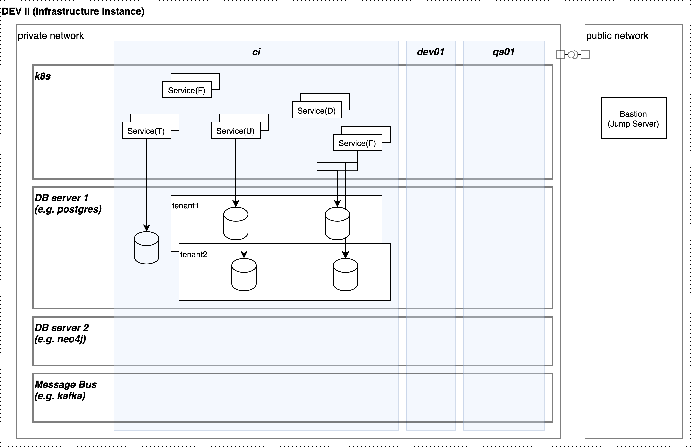

# tln clouds
Cloud agnostic, enterprise grade, bulletproof, battle tested IaC skeleton for SaaS solutions.

## Features
Framework:
* supports AWS, Azure, GCP, Digitalocean provider
* provides Multi-tenancy feature via layers architecture
* implements nested condigurations for Infrastructure Instance and Environments
* is based on IaC/Terraform
* includes support of multiple backend providers - Local, Cloud, Remote,  PG, S3
